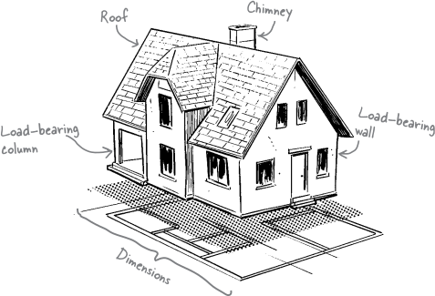
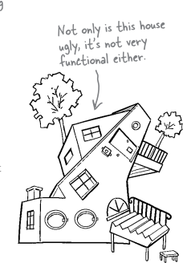
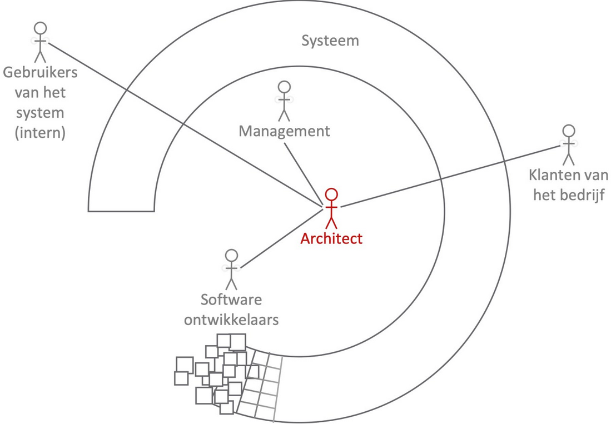
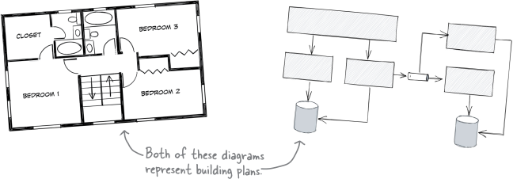

# ICT Architecture

---
# Algemene info

- lector: vincent.nys@ap.be
- [ECTS-fiche](https://bamaflexweb.ap.be/BMFUIDetailxOLOD.aspx?a=221856&b=5&c=1)

---
# Doel van het OLOD

- ICT-oplossingen maken
  - analyse van de context leren maken
  - ontwerp maken, documenteren en communiceren
  - veelgebruikte benaderingen bestuderen
  - belangrijke tools

note:

- "oplossingen" omvat hard- en software
- "communiceren": geen zuiver diagrammenvak, maar architect staat voortdurend in contact met opdrachtgever en developers

---
# Benadering

- 1u theorie / week
- 2u labo

(zoals DevOps)

---
# Materiaal

- wordt herwerkt tegenover 2023-2024
  - afgeraden lessen te skippen als je herneemt (meer dan anders!)
- topics verschijnen doorheen semester op DigitAP
- voornaamste referenties:
  - Head First Software Architecture (Gandhi, Richards en Ford)
  - The Kubernetes Book (Nigel Poulton)
  - [Playlist Microservices Pluralsight](https://www.pluralsight.com/paths/microservices-architecture)

---
# Toetsing (1)

- 50% (individuele) projectopdracht, verder opgedeeld in:
  - 30% analyse
  - 60% technische uitwerking
  - 10% presentatie

Komt vrij voor de paasvakantie (dus rond week 8).

---
# Toetsing (2)

- 50% examen
  - je krijgt een probleemstelling
  - maak of vervolledig een ontwerp
  - verantwoord je keuzes volgens de geziene methodes
  - documenteer met diagrammen en tekst

Hier is geen "perfecte" oplossing. Wel goed en slecht onderbouwde.

---
# Geplande stof

- architecturale karakteristieken
  - achterhalen, prioritiseren,...
- logische componenten
  - identificeren en implementeren
- architecturale beslissingen
  - uitschrijven en opvolgen
- architecturale stijlen
  - layered
  - modular monolith
  - microkernel
  - microservices
    - Kubernetes en specifieke diensten
---

# ICT-architectuur
"[...] het **structurele** ontwerp van informatietechnologiesystemen, inclusief hardware, software, netwerken en dataopslag. Deze architectuur dient als raamwerk voor het opzetten en beheren van IT-systemen en bepaalt hoe verschillende technologische componenten met elkaar interageren. De architectuur zorgt ervoor dat de IT-infrastructuur efficiënt, schaalbaar en veilig is, en voldoet aan de behoeften van gebruikers en organisaties."

---

# Software architectuur
"[...] de fundamentele structuur van een softwaresysteem, waarbij het zich richt op de organisatie van en de interactie tussen verschillende componenten. Deze architectuur bepaalt hoe softwarecomponenten samenwerken om functies en prestaties te leveren. Het gaat om het maken van strategische keuzes in softwareontwerp om een efficiënt, schaalbaar en onderhoudbaar systeem te creëren."

---

# Samengevat
- software architectuur ⊂ ICT-architectuur
- onderscheid is sterk vervaagd sinds opkomst (private en public) cloud
  - zullen hier meestal gewoon over "architectuur" spreken

---

❓ Waarom en wanneer spreek je wel/niet met een klassieke architect?

note:
- betreft structurele kwesties
- moet een totaalvisie zijn
- moet rekening houden met noden op lange termijn
- stelt een bouwplan op waar**binnen** je moet werken
  - niet zuiver "programmeren", maar wel bepalen wat een optie is om te programmeren

---

note:
- functionele componenten
- omvat esthetiek maar ook praktische kant, veiligheidsvoorschriften,...
- opgebouwd met kennis en ervaring van trade-offs

---

note:
- gebrek aan samenhang
- ziet er ook minder stabiel en veilig uit
- hier een stukje bij, daar een stukje,...
- tegenhanger is de "big ball of mud"

---

# Rol architect

note:

- architect moet met iedereen overleggen om te zien wat wenselijk, haalbaar,... is
- ook als *jij* eerder programmeur (of andere technische functie) wil zijn: belangrijk de taak van deze persoon te begrijpen en specifieke architecturen te kunnen implementeren (we zullen ook redelijk veel tools zien)

---

# Bouwen of verbouwen
- invalshoek is eerder "greenfield"
- realiteit is vaker "brownfield"

note:
- greenfield = nieuw project, alles moet nog uitgewerkt worden, totale vrijheid
- brownfield = voortbouwen op bestaand werk, kan belangrijke beperkingen met zich meebrengen
- zelfde basisskills, maar met greenfield slaan we geen stappen over

---

note:
- doel is hetzelfde: we voorzien een algemene structuur waarbinnenin gewerkt wordt
- hier buiten gaan (bv. willekeurige muur slopen) kan eigenschappen en werking in gedrang brengen

---

# dimensies (1)

1. architecturale karakteristieken
2. architecturale beslissingen
3. logische componenten
4. architecturale stijl

note:

**Opgelet**: Terminologie is wat minder afgebakend dan in zuiver technische vakken zoals die rond programmeertalen. Het is mogelijk dat je online synoniemen of andere interpretaties van begrippen tegenkomt.

De karakteristieken zijn de belangrijkste **eigenschappen** van een systeem. Het gaat hier niet over **wat** het systeem doet (de functionaliteit), maar over **hoe** het systeem omschreven kan worden ("performant", "veilig", "robuust", "goedkoop in onderhoud",...).

De beslissingen zijn knopen die doorgehakt zijn die signficante impact hebben op de werking en eigenschappen van het systeem. Bijvoorbeeld het achterliggend type database (SQL? Iets anders?), manieren van communiceren tussen onderdelen (synchroon? asynchroon?), enzovoort.

Logische componenten zijn de bouwblokken van het totale systeem. Een systeem voert meerdere taken uit, dus hoe is het totaal opgesplitst in onderdelen en welke onderdelen spreken tegen elkaar?

Een architecturale stijl is een heel algemeen plan voor de opbouw van een systeem. Er zijn verschillende stijlen om uit te kiezen (net als bouwstijlen). Er is geen "perfecte" stijl. Elke stijl heeft een invloed op wat mogelijk is en wat niet, op de eigenschappen,...

---

# dimensies (2)

Moodle (DigitAP):

1. schaalbaarheid (AP is toch al vrij groot), uitbreidbaarheid (werkt met plugins), veiligheid (rollen), interoperabiliteit (gestandaardiseerde formaten zoals LTI)
2. database (SQL), programmeertaal (PHP), werking pluginsysteem (extra PHP source files),...
3. logische componenten: gebruikersbeheer, cursusbeheer, beoordelingen,...
4. architecturale stijl: [eerder modular monolith](https://docs.moodle.org/405/en/Moodle_site_moodle_directory) (deelapplicaties die intern gelaagd zijn)

note:

Eerste versie dateert van 2002. Dus developers werken met veel bagage ⇒ brownfield, sommige zaken zijn "bij benadering" aanwezig. Net zoals "Gotische stijl" verschillen vertoont naargelang tijd en plaats.

Greenfield implementatie zou waarschijnlijk niet hetzelfde systeem opleveren.

---

# Architectuur vs. design (1)

- architectuur ≈ structuur van een huis
- design ≈ inrichting
- keuzes vallen op een spectrum

---

# Architectuur vs. design (2)

- strategisch (lange termijn) vs. tactisch (kortere termijn)
- veel of weinig werk
- veel of weinig trade-offs

note:

Opnieuw geen perfecte consensus rond begrippen. Je zal bv. soms ook "MVC architecture" (↔ "MVC pattern") tegenkomen omdat dat patroon een bredere impact heeft dan bijvoorbeeld "Visitor" of "State". Maar we zien het hier eerder als een manier om een architectuur met een bepaalde stijl te implementeren (bv. modular monolith). Een architectuur moet rekening houden met meer zaken (de 4 dimensies).
