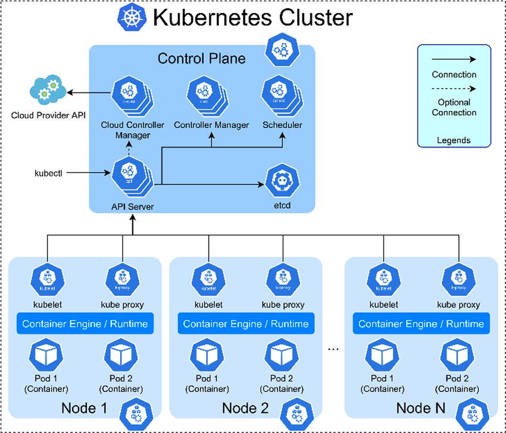
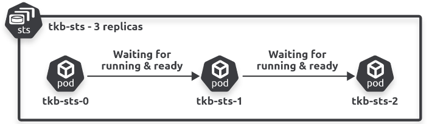
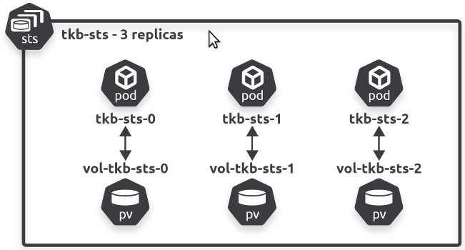
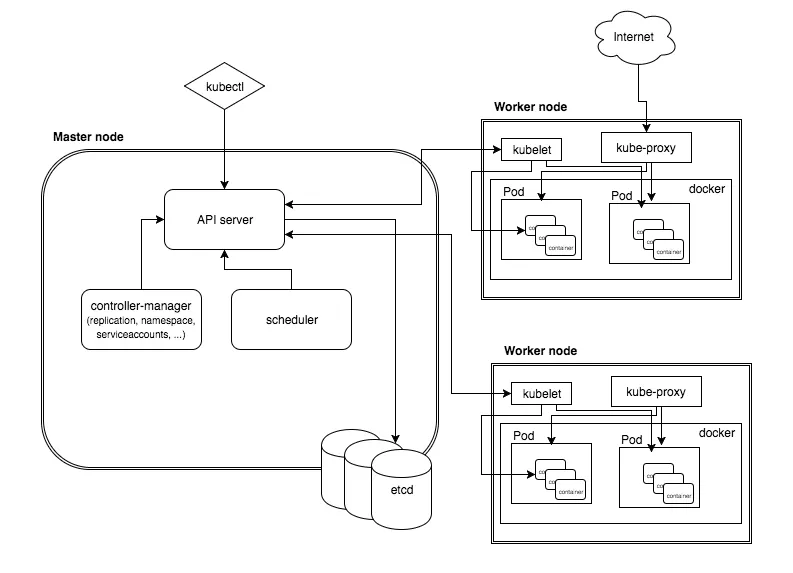

## StatefulSets en Helm

---

### Recap: single-node vs. multi-node


note:
- veel interne onderdelen vermeld
- belangrijk hier dat pods op verschillende *nodes* runnen
  - dat zijn verschillende (fysieke of virtuele) machines, in de praktijk best op verschillende geografische locaties

---

### Uitdagingen gedistribueerde aanpak

note:
- paar keer vermeld: "Pods zijn stateless" en "Pods worden vervangen door nieuwe Pods van hetzelfde type"
- voorbeeld van iets dat mis kan lopen:
  - we hebben een cluster met meerdere nodes
  - we hebben een `Deployment` met één replica voor een MySQL server
  - de `Pod` heeft een `PersistentVolumeClaim` voor een volume dat gemapt wordt op `/var/lib/mysql` (zodat data bijgehouden wordt)
  - het toegewezen volume is lokale opslag van de host node, bijvoorbeeld `/data`
  - de `Pod` moet vervangen worden (crash of update)
  - de vervanger komt wordt op een andere node geplaatst
  - `/data` bevat niet de gewenste data!
- dit soort problemen kom je minder makkelijk tegen in een single-node cluster met één replica, maar dat is eigenlijk alleen maar een didactische tool

---

### Idee oplossing

note:
- Pods moeten vervangen worden door Pods met zelfde "state"
  - zelfde naam
  - zelfde DNS hostnaam
  - zelfde volume bindings

---

### StatefulSet

note:
- zoals een `Deployment`
- maar vervangers van Pods hebben dezelfde state als het origineel
  - zelfde naam
  - zelfde DNS hostnaam
  - zelfde volume bindings
  - **zelfs** als ze vervangers op andere nodes worden geplaatst
- typische toepassingen
  - geclusterde applicaties (peer-to-peer of primary-secondary)
  - persistent storage
- niet alleen maar voordelen:
  - Pods moeten één voor één opstarten en uitgeschakeld worden (anders zouden er bugs optreden)
  - moeten terugschalen naar 0 replica's voor we een `StatefulSet` verwijderen
  - kunnen andere beperkingen zijn rond welke functionaliteit van je cloud provider je in een StatefulSet kan gebruiken

---

### Sequentie


---

### Mapping volumes



note:
- volumes kunnen op verschillende manieren geïmplementeerd zijn. Een directory op de host node is er één, maar zeker in een multi-node setup is dit niet zo vanzelfsprekend
- persistente volumes bestaan *los* van Pods, dus het is belangrijk dat ze toegekend worden aan "dezelfde" pods
- merk op hoe de namen van de Pods binnen dezelfde StatefulSet systematisch toegekend zijn en makkelijk te matchen zijn aan de volumes
- **implicatie**: `StatefulSet` kan ook zinvol zijn als er maar één replica is, want met sommige clusterconfiguraties en storagetypes is niet gegarandeerd dat vervanger steeds zelfde storage krijgt
- we gebruiken `volumeClaimTemplates` (in plaats van `PersistentVolumeClaim`), het gaat technisch om een nieuwe claim wanneer we een pod vervangen

---

### Demonstratie 1

note:
- start alleen de `StatefulSet` in bijlage `mongo-statefulset`
- inspecteer de definitie en merk op: `serviceName`
- doe `kubectl get pods`
- voer de `kubectl explain` vermeld in het tekstbestand
- **pods zijn normaal niet aanspreekbaar via DNS-entry voor naam**, vandaar dat een `StatefulSet` een "governing service" nodig heeft (want Services registreren records in interne DNS)
- dit wordt een speciaal soort `Service`, namelijk een **headless** `Service`
  - deze spreken we niet aan zoals een `ClusterIP` service (of `NodePort` of `LoadBalancer`) maar hij creëert wel DNS-entries **voor de achterliggende Pods**
    - het "head" is dus het eigen cluster IP van de service: dat is hier niet aanwezig
- om dit aan te tonen: start eerst de `StatefulSet` zonder een governing service, log in op een Pod, probeer een van de andere te pingen via naam (bv. `ping tkb-sts-1.tkb-sts` vanuit `tkb-sts-0`)
  - herhaal dan na opzetten van de headless service

---

### Demonstratie 2



note:
- voorbeeld: MySQL met primary (writeable) en secondary (read-only, synct regelmatig met primary)
  - manier om performance te verbeteren zonder totaal nieuwe DB te gebruiken
  - behoren tot zelfde `StatefulSet` maar hebben ander configuratiebestand
    - we gebruiken init containers die de podnamen bekijken om de juiste pod het juiste configuratiebestand te geven
  - oké zolang clients van de secondary iets oudere data te zien mogen krijgen
- **dit kost tijd en moeite, ook zonder Kubernetes of Docker**: stappen [hier](https://dev.mysql.com/doc/refman/8.4/en/replication-howto.html) en info [hier](https://hub.docker.com/_/mysql) nodig gehad en moeten lezen
  - indien bij dergelijk voorbeeld niet meteen duidelijk is hoe je het moet aanpakken, vereenvoudig dan (begin bijvoorbeeld met replicatie in Docker containers in plaats van Pods)
- onthoud vooral:
  - er zijn twee replica's
  - beide replica's hebben eigen files nodig (configuratie en opstartscripts)
  - we moeten kunnen garanderen dat de primary een vast adres heeft (`mysql-0`)
- uittesten: makkelijkste is op de replica in te loggen en te merken dat we aanpassingen van de primary zien

---

## Helm

note:
- betekenis: "roerwiel van een schip" (Kubernetes is Grieks voor "stuurman")
- wordt omschreven als "package manager voor Kubernetes"
- packages voor een programmeertaal (bv. NPM packages voor JavaScript) zorgen dat je zelf alle code niet hoeft te schrijven die je gebruikt
- "Helm Charts" (packages voor Kubernetes) zorgen dat je niet zo veel YAML hoeft te schrijven
- je hoeft dit niet te gebruiken, maar je kan het tegenkomen en het kan werk voor je uitsparen
  - je hoeft dit ook niet te gebruiken voor je project, maar het mag wel

---

## Structuur van een Helm Chart

```text
mijn-helm-chart/
├── Chart.yaml  # metadata
├── values.yaml # defaultconfiguratie, zoals omgevingsvariabelen
├── templates/  # Kubernetes manifests met variabelen
├── charts/     # dependencies
└── .helmignore # niet noodzakelijk in eindproduct
```

---

## Installatie

```sh
curl https://raw.githubusercontent.com/helm/helm/main/scripts/get-helm-3 | bash
helm version
```

---

## Chart repositories

```sh
helm repo add bitnami https://charts.bitnami.com/bitnami
helm repo update
helm search repo bitnami
```

note:
- vergelijk met apt repositories of met Docker registries (zoals Docker Hub)
  - een verzameling Charts waaruit je kan installeren

---

## Charts installeren 

```sh
helm install mijn-nginx-release bitnami/nginx
kubectl get pods
kubectl get svc
```

note:
- wat in de cluster runt, wordt een "release" van de chart genoemd

---

## Release customizen

```yaml
# dit zijn waarden die ondersteund worden in de NGINX Helm chart
# kijk in de documentatie van een chart
# vergelijk met opzoeken parameters op Docker Hub
replicaCount: 2
podLabels:
  additionalLabel: someValue
```

```sh
helm install -f custom-values.yaml mijn-nginx-release bitnami/nginx
```

note:
- zie uitleg onder "parameters" op https://github.com/bitnami/charts/tree/main/bitnami/nginx
  - de `values.yaml` die er al staat, bevat de defaultwaarden
  - in de map `templates` staat de YAML die ingevuld wordt met de uiteindelijke waarden
- check achteraf de pods met `kubectl describe`, het extra label zou er moeten zijn

---
```yaml
architecture: "replication"
auth:
  user: "user"
  rootPassword: "newRootPassword123"
  password: "newUserPassword123"
  replicationPassword: "newReplicationPassword123"
passwordUpdateJob:
  enabled: true
```

```sh
helm install -f custom-values.yaml my-release oci://registry-1.docker.io/bitnamicharts/mysql
```
