# Fysieke architectuur en tracing

---

## Fysieke architectuur

note:
- niet "welke componenten"
- wel "wat maakt de componenten mogelijk"
  - servers / nodes
  - databanken
  - user interfaces
  - message queues
  - gateways
- eigenlijk zie je niet waar de logische componenten zitten
- je maakt achteraf een mapping

---

## Logische architectuur ticketing systeem


---

## Fysieke architectuur ticketing


---

## Mapping


---

## Met Mermaid, voor Kubernetes

```mermaid
%%{init: {'theme':'dark'}}%%
architecture-beta


  service cloudloadbalancer(cloud)[Cloud load balancer]
  service databasestorage(disk)[Storage for database]
  group cluster(cluster)[Kubernetes Cluster]

  group workernode1(server)[Worker node 1] in cluster
  group workernode2(server)[Worker node 2] in cluster

  group ingresspod(pod)[Ingress Pod] in workernode1
  service ingresscontroller(internet)[Ingress Controller] in ingresspod

  service webappservice(internet)[Web app ClusterIP Service] in cluster
  service dbservice(internet)[Database ClusterIP Service] in cluster
  
  group webapppod1(pod)[Web app pod 1] in workernode1
  service webappcontainer1(container)[Web app container] in webapppod1

  group webapppod2(pod)[Web app pod 2] in workernode2
  service webappcontainer2(container)[Web app container] in webapppod2

  group databasepod1(pod)[Database pod 1] in workernode2
  service databasecontainer1(container)[Database container] in databasepod1

  webappservice:B --> T:webappcontainer1
  webappservice:L --> R:webappcontainer2
  ingresscontroller:L --> R:webappservice
  cloudloadbalancer:L --> R:ingresscontroller
  webappcontainer1:L --> R:dbservice
  webappcontainer2:B --> T:dbservice
  dbservice:B --> T:databasecontainer1
  databasecontainer1:B -- T:databasestorage
```



note:
- heb benadering gezocht voor icoontjes, je kan icon sets gebruiken maar dan moest ik die in de slides installeren...
- ik gebruik een self-managed database voor dit voorbeeld, een managed database kan ook (en teken je buiten de cluster)
- toon welke nodes je hebt (control plane kan je eventueel achterwege laten)
- duid de grenzen van de cluster aan
- niet alles valt in de cluster: cloud load balancer, managed databases, volumes,...
- **let op**: Mermaid layout is niet perfect, visueel lijken Services binnen Nodes te vallen maar (lees de diagramtekst) een Service is niet gebonden aan een specifieke node
  - kan mogelijk gefixt worden mits prulwerk met junctions,...

---

## OpenTelemetry

note:
- puntje "observability" opdracht
- "telemetry" = verzamelen en doorsturen van gebruiksdata

---

## Reminder

note:
- gedistribueerde architecturen (microservices) maken debuggen moeilijker
  - uitvoering van de code volgen met debugger gaat niet zomaar, zeker niet doorheen de hele applicatie
- telemetry kan dit deels opvangen
  - en dan kunnen we achteraf nog debuggen in de problematische service

---

## Rol OpenTelemetry

note:
- **gestandaardiseerde** manier om specifieke vormen van telemetry te **genereren**
  - gelijkaardig aan voordeel Kubernetes: vendor agnostic
  - opslag en visualisatie zijn andere aspecten
    - OpenTelemetry werkt **samen** met gespecialiseerde tools voor visualisatie en/of opslag, o.a. Jaeger, Prometheus, HoneyComb, NewRelic,...
      - bekijk wat je nodig hebt voor het type data dat je wil gebruiken, niet elke tool is voor alle observeerbare data

---

## "Observability"

- Metrics
- Events
- Logs
- **Traces**

note:
- observability als eigenschap: hoe goed we kunnen inschatten wat het systeem aan het doen is en waarom
- OpenTelemetry biet ondersteuning voor al deze zaken, maar wij gaan focussen op traces
- metrics: "time series", dus eenzelfde ding dat regelmatig gemeten wordt
  - bv. hoe men de temperatuur in Ukkel noteert...
- event: "er is iets gebeurd", voorgesteld als een object met metadata
  - handboek legt ook "event-driven architecture" uit maar dat paste niet meer
  - niet noodzakelijk bedoeld zuiver voor observability, zie dit als een soort push notification waarmee je kan doen wat je wil
  - je kent dit concept: event handlers in JS (buttonClicked), Git hooks,...
- logs: prints met timestamps, bedoeld zuiver om te kunnen nalezen
- traces: traject van een (typisch HTTP) request, van start request tot einde response
  - formaat kan je zien in je browser
  - wij zijn niet alleen geïnteresseerd in interactie client - gateway, maar ook in hoe calls naar interne services verlopen

---


---

## Basisvoorbeeld uitvoeren

note:
- https://opentelemetry.io/docs/languages/js/getting-started/nodejs/

---

## Zipkin gebruiken

```javascript
const { ZipkinExporter } = require('@opentelemetry/exporter-zipkin');
// ...
const traceExporter = new ZipkinExporter({});
//... 
```

note:
- zie https://www.npmjs.com/package/@opentelemetry/exporter-zipkin voor opties,...

---

## Distributed tracing

note:
- tracing voor requests die over meerdere services gaan
- in essentie gewoon de tracingcode voorzien in de container voor elke service en een ClusterIP service voorzien die naar de Zipkin leidt
  - code en servicenaam voorzien kan via ConfigMap

---

## Calls correleren

```
const { context, propagation } = require('@opentelemetry/api');

async function makeRequest() {
  const headers = {};
  propagation.inject(context.active(), headers);
  // we willen dat deze fetch gekoppeld wordt aan deze call van makeRequest!
  const response = await fetch('http://downstream-service/api', {
     method: 'GET',
     headers,
  }); 
  // doe gerust nog andere dingen
}
```

note:
- soms wordt context automatisch doorgegeven, maar het hangt af van hoe goed de ondersteuning van OpenTelemetry voor jouw tools is

---

## Implementatie in Kubernetes
