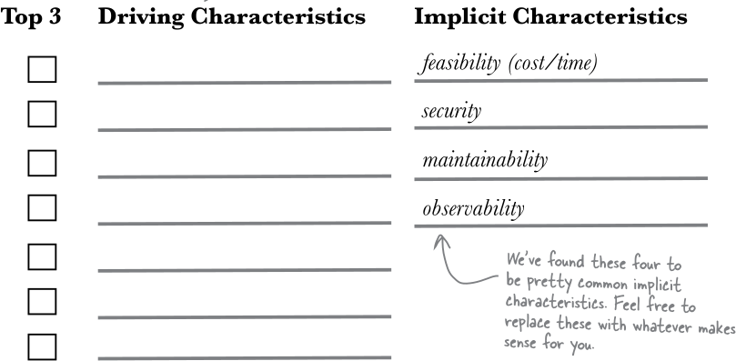

# Architecturale karakteristieken

note:
- in andere teksten vaak "nonfunctional requirements" genoemd
- handboek doet dit niet: klinkt "minder belangrijk", is **niet** zo
---

## Case

- Sillycon Symposia: bedrijf dat ludieke technologieconferenties organiseert
- Ter ondersteuning: Lafter, een sociaal medium voor sprekers en bezoekers

---

## Requirements document (1)

- Gebruikers: (honderden) sprekers, (duizenden) bezoekers
- Requirements:
  - Users kunnen een account aanmaken
  - Users kunnen "jokes" (lange posts) en "puns" (korte posts) maken
  - Users kunnen berichten tot 281 karakters posten
  - Users kunnen links posten

note:
- omvat zowel functionaliteit als karakteristieken
- soms wordt hier dus gesproken over "functional" en "nonfunctional" requirements
- characteristics kunnen implicieter geformuleerd zijn
- "berichten tot 281 karakters" = "jokes"? zal moeten blijken!

---

## Requirements document (2)

  - Followers kunnen "Haha" of "Giggle" reageren
  - Sprekers hebben een eigen icoontje
  - Sprekers kunnen een forum opzetten over hun eigen topic
- Context:
  - Ondersteuning voor internationaal gebruik
  - Kleine support staff
  - Pieken in verkeer (tijdens conferenties)

note:
- Wat hier als "context" geformuleerd is, vertaalt vrij goed naar architecturale karakteristieken
- Dit soort document wordt typisch door business analysten opgesteld

---

- "Nondomain design considerations": karakteristieken zijn niet het **wat**, maar het **hoe** van de oplossing
  - "Domain" = het gebied waarin we bezig zijn
- "De architecturale karakteristieken vormen criteria voor succes, geven aan hoe we de requirements moeten implementeren en waarom bepaalde keuzes gemaakt zijn."

note:
- enkele voorbeelden van domeinen: conferencing, auto-industrie, petrochemie, geneeskunde
- voorbeeld eigen eerste job: gezondheidssector, veel onzichtbare details (RIZIV-nummers, statuut van dierenartsen, al dan niet zelfstandige verpleegkundigen)

---

note:
- moeten met drie perspectieven kijken naar ons requirements document
  - welke "nondomain design considerations" zijn expliciet vermeld?
    - staan dus op een of andere manier in het document
  - welke beïnvloeden impliciet ook de structuur die we kunnen hanteren?
  - welke zijn het belangrijkst voor onze applicatie?

---
## Impliciete invloed op structuur

%%{init: {'theme': 'dark', 'themeVariables': { 'darkMode': true }}}%%
architecture-beta
    group monolith(server)[Monolith]

    service promote[Promote event] in monolith
    service promotions[Promotions] in monolith
    service post_message[Post message] in monolith
    service add_event_user[Add event user] in monolith
    junction junctionA in monolith
    junction junctionB in monolith
    junction junctionC in monolith

    service db(database)[Database]

    promote:B -- T:junctionA
    add_event_user:R -- L:junctionA

    post_message:B -- T:junctionB
    promotions:L -- R:junctionB

    junctionA:R -- L:junctionC
    junctionB:L -- R:junctionC
    junctionC:B --> T:db

note:
- monolithische deployment
- verschil tussen "promotions" en "promote event": zoals bij voting app Kubernetes
- deployment is relatief simpel
- fix of update aan een onderdeel vereist redeployment

---

%%{init: {'theme': 'dark', 'themeVariables': { 'darkMode': true }}}%%
architecture-beta
    service promote(server)[Promote event]
    service promote_db(database)[Promote event database]
    promote:B --> T:promote_db

    service promotions(server)[Promotions]
    service promotions_db(database)[Promotions database]
    promotions:B --> T:promotions_db

    service post_message(server)[Post message]
    service post_message_db(database)[Post message database]
    post_message:B --> T:post_message_db

    service add_event_user(server)[Add event user]
    service add_event_user_db(database)[Add event user database]
    add_event_user:B --> T:add_event_user_db

note:
- services worden apart gedeployed
- omvat herhaling code, moeilijker te tracen
- **maar** staat wel toe services apart te updaten,...

---

## Beperken van de karakteristieken
- kunnen niet alles doen
- geen exhaustieve lijst of universele terminologie
- synergieën
- toename van criteria

note:
- je kan wel een [lijst voor inspiratie](https://iso25000.com/index.php/en/iso-25000-standards/iso-25010) raadplegen
- synergieën kunnen negatief zijn (bv. performance ↔ security) of positief (bv. extensibility en interoperability)

---

## Bronnen van karakteristieken

- het probleemdomein
- kennis van de omgeving (is klant een startup, een groot bedrijf,...?)
- ervaring met het domein

---

## Karakteristieken Sillycon Symposia

  

    <ul>
      <li>account aanmaken</li>
      <li>"jokes" en "puns" maken</li>
      <li>berichten tot 281 karakters posten</li>
      <li>links posten</li>
      <li>"Haha" of "Giggle" reageren</li>
      <li>een eigen icoontje</li>
      <li>sprekers kunnen een forum opzetten over hun eigen topic</li>
      <li>ondersteuning voor internationaal gebruik</li>
      <li>kleine support staff</li>
      <li>pieken in verkeer (tijdens conferenties)</li>
    </ul>
  

  

    <ul>
      <li>scalability (veel users)</li>
      <li>elasticity (pieken)</li>
      <li>authentication (users)</li>
      <li>authorization (soorten users)</li>
      <li>internationalization (zie context)</li>
      <li>customizability (aanmaak forums, icoontjes)</li>
      <li>fault tolerance (kleine support staff)</li>
    </ul>
  

---

## Oplossingen vs. requirements
- klant: "nieuw vliegtuig moet mach 2.5 halen"
- redenering: duur, dus moet kunnen ontsnappen
- probleem: beperkt door technologie
- oplossing: zeer manoeuvreerbaar i.p.v. zeer snel

note:
- in de redenering valt **requirement** te ontwaren

---

## Composites
- brede karakteristieken zoals "performant" of "betrouwbaar"
- soms nodig op te breken in **meetbare** karakteristieken
  - bv. performance
    - eerste page load time
    - totale laadtijd
    - gemiddelde responstijd
    - bovengrens responstijd
---

## Keuzes maken
- kies de belangrijkste 7 ("driving characteristics")
- maak achteraf een top 3
- impliciete zijn altijd zinvol, herhaal ze eventueel onder "driving"

note:
- 7 past binnen de structuur van ons werkgeheugen
- waarschijnlijk nergens 2 identieke lijsten

---

## Keuzes maken (diagram)

---

# Architecturale beslissingen

---

## Case: Two Many Sneakers

van

%%{init: {'theme': 'dark', 'themeVariables': { 'darkMode': true }}}%%
architecture-beta

    service trading(server)[trading]
    service db(database)[database]
    trading:R --> L:db

naar

%%{init: {'theme': 'dark', 'themeVariables': { 'darkMode': true }}}%%
architecture-beta

    service trading(server)[trading]
    service notifications(server)[notifications]
    service analytics(server)[analytics]
    service db(database)[database]
    trading:T --> B:analytics
    trading:R --> L:db
    trading:B --> T:notifications

note:
- Two Many Sneakers is platform voor het kopen en verkopen van sneakers
- Oorspronkelijk gewoon een server die wordt aangesproken door mobile app
- Nood aan extra subsystemen:
  - analytics voor fraudedetectie
  - notifications om users te informeren

---

"Hoe gaan we deze bijkomende interacties implementeren?"

---

## Opties

1. web services (REST/GraphQL/...)
2. message queues (kan met RabbitMQ)
3. topics (kan ook met RabbitMQ)

---

## Message queues vs. topics

%%{init: {'theme': 'dark', 'themeVariables': { 'darkMode': true }}}%%
architecture-beta

    service trading(server)[trading]
    service notification_queue[notification queue]
    service analytics_queue[analytics queue]
    service notifications(server)[notifications]
    service analytics(server)[analytics]
    service db(database)[database]
    trading:L --> R:db

    trading:R --> L:notification_queue
    notification_queue:R --> L:notifications

    trading:B --> T:analytics_queue
    analytics_queue:R --> L:analytics

%%{init: {'theme': 'dark', 'themeVariables': { 'darkMode': true }}}%%
architecture-beta

    service trading(server)[trading]
    service topics[topics]
    service notifications(server)[notifications]
    service analytics(server)[analytics]
    service db(database)[database]
    trading:L --> R:db

    trading:R --> L:topics
    topics:R --> L:notifications
    topics:B --> T:analytics

note:
- beide manieren om te communiceren tussen diensten
- eerste vereist aparte queue per consumer
  - inhoud van elke queue kan verschillen
- tweede vereist één globale "splitter"
  - diensten kunnen zich aansluiten op "splitter"

---

<table>
  <tr><th>web services</th><th>queues</th><th>topics</th></tr>
  <tr><td style="color: green">goed gekend</td><td>matig gekend</td><td>matig gekend</td></tr>
  <tr><td style="color: green">heterogene berichten</td><td style="color: green">heterogene berichten</td><td style="color: red">homogene berichten</td></tr>
  <tr><td>synchroon</td><td>asynchroon</td><td>asynchroon</td></tr>
  <tr><td style="color: red">sterke koppeling</td><td>matige koppeling</td><td style="color: green">zwakke koppeling</td></tr>
  <tr><td style="color: red">service mag niet uitvallen</td><td style="color: green">buffering + gedetailleerde scaling</td><td>buffering</td></tr>
  <tr><td style="color: red">extra werk security</td><td></td><td style="color: red">extra werk security</td></tr>
  <tr><td>...</td><td>...</td><td>...</td></tr>
</table>

note:
- queues zijn niet "beter" omdat er minder rood is!
- de keuze zal contextafhankelijk zijn

---

## Eerste wet van software architectuur

Everything is a trade-off.

---

## Architecturale beslissingen

- kunnen structuur beïnvloeden
- kunnen genomen worden om karakteristiek te verkrijgen

note:
- eerste: welke services, wie welke database contacteert
- tweede: keuze voor queues tegenover topics, keuze bepaalde programmeertaal of andere technologie,...

---

## Tweede wet van software architectuur

**Why** is more important than **how**.

---

- "How" is simpel: kijk naar de codebase
- "Why": **niet** op het zicht duidelijk

note:
- comments zijn handig om kleine beslissingen te verantwoorden

---

## Architectural Decision Records

- document per architecturale beslissing
- vaste structuur (kan per bedrijf variëren)
- geen "user-facing documentation"
  - wel uitstekend voor nieuwe developers
- append-only
- plain text formaat is handigst en kan in versiebeheer
- typisch per project, kunnen op organisatieniveau

note:
append-only betekent dat we inhoud van een ADR niet aanpassen eens het aanvaard is, we kunnen alleen vermelden dat het geschrapt of vervangen is

---

## Mogelijke template
- title: nummer en samenvatting op één regel
- status: RFC, proposed, accepted of superseded
  - "superseded by XYZ" en "supersedes ABC" voor betere verwijzingen
- context: alle factoren om in rekening te brengen, zonder beslissing
- decision: de gemaakte keuze, kordaat uitgedrukt, samen met **objectieve** verantwoording
- consequences: wat wordt (on)mogelijk, welk werk ontstaat of valt weg,...
- governance: hoe zorgen we dat dit wordt opgevolgd (bewustmaking, audits,...)
- notes: algemene opmerkingen, metadata (kan deels via versiebeheersysteem)

note:
- nummer in titel: best opvullen met nullen om makkelijk te lezen
- RFC = request for comment, proposed = intern bekeken maar moet verder goedgekeurd worden, zie toestandsdiagram volgende slide

---

## Toestandsdiagram

%%{init: {'theme': 'dark', 'themeVariables': { 'darkMode': true }}}%%
stateDiagram-v2
    state if_state_1 &lt;&lt;choice&gt;&gt;
    state if_state_2 &lt;&lt;choice&gt;&gt;
    [*] --> RFC
    RFC --> if_state_1
    if_state_1 --> Accepted
    if_state_1 --> Proposed: overleg met anderen nodig
    Proposed --> Accepted
    Accepted --> if_state_2
    if_state_2 --> Superseded: nieuwe informatie maakt ADR niet meer van toepassing
    Superseded --> [*]

---

- Title: 012: Gebruik van queues voor asynchrone messaging vanaf tradingdienst
- Status: Accepted
- Context: De trading service moet andere diensten (voorlopig: analytics en notifications) op de hoogte brengen van nieuwe producten en van elke verkoop. Dit kan via web services (REST e.d.) of via asynchrone messaging (queues of topics).
- Decision: **We zullen queues gebruiken.** Queues maken het systeem veelzijdig, aangezien elke queue andere soorten berichten kan afleveren. Ze maken het systeem ook veiliger aangezien de trading service steeds weet wie de queues uitleest.
- Consequences: De koppeling tussen diensten zal hoger zijn, want elke nieuwe queue moet ondersteund worden door de trading service. We zullen ook infrastructuur voor de queues moeten voorzien.

---

[extra tools voor ADR](https://adr.github.io/#decision-capturing-tools)
