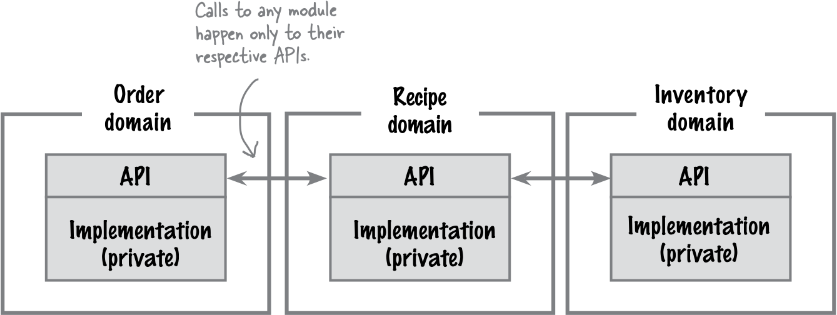

# Architecturale stijlen

---

<table>
<tr><td colspan="2" style="border: none;"></td><th colspan="2" style="text-align: center">Partitionering</th></tr>
<tr><td colspan="2" style="border: none;"></td><th>Technisch</th><th>Op basis domein</th></tr>
<tr><th rowspan="2" style="writing-mode: sideways-lr; vertical-align: middle; border: none">Deployment</th><th style="writing-mode: sideways-lr">Monolitisch</th><td><ul><li>gelaagd</li><li>microkernel</li></ul></td><td>modulaire monoliet</td></tr>
<tr><th style="writing-mode: sideways-lr; border: none;">Gedistribueerd</th><td>event-driven</td><td>microservices</td></tr>
</table>

note:
- overzicht van de stijlen (event-driven gaan we uiteindelijk niet behandelen)
- stijl zal bepalen hoe we componenten van eerder concreet gaan realiseren
- er bestaan er nog (bv. voor realtime systemen), maar deze zijn algemeen bruikbaar
- monolitisch in logische zin kan nog steeds fysiek verdeeld zijn, maar dat is wel minder vanzelfsprekend

---

- technische partitionering
  - presentatie
  - logica
  - persistentie
- partitionering op basis domein
  - klanten
  - betalingen
  - verzendingen

note:
- uiteraard alleen maar voorbeelden
- zowel in technische partitionering als in die op basis domein andere grenzen mogelijk

---

"Mag ik bij opdeling volgens domein geen opdeling in presentatie/logica/persistentie toepassen?"

note:
- Jawel! Maar dan is dat een implementatieaspect.
  - weerspiegeld in namespacing: `app.presentation.customer` vs. `app.customer.presentation`
  - maakt een verschil: technische partitionering is goed als teams technische specialisaties hebben, domeinpartitionering als ze per team veel expertise over een deeldomein hebben

---

<div style="display: flex; justify-content: space-around">
<div><header>Monolitisch</header>
  <div class="mermaid">
%%{init: {'theme': 'dark', 'themeVariables': { 'darkMode': true }}}%%
block-beta
  block
    customer
    payment
    shipping
  end

  %% ronde haakjes voor afgerond blok
  customer("Customer")
  payment("Payment")
  shipping("Shipping")

  %% rx en ry zorgen voor mate afronding
  classDef component rx:10px,ry:10px,height:4em
  class customer component
  class payment component
  class shipping component
  </div>
  </div>
  <div>
  <header>Gedistribueerd</header>
    <div style="display: flex; justify-content: space-around">
    <div class="mermaid">
%%{init: {'theme': 'dark', 'themeVariables': { 'darkMode': true }}}%%
block-beta
block
  customer
end
  classDef component rx:10px,ry:10px,height:4em
  class customer component
    </div>
    <div class="mermaid">
%%{init: {'theme': 'dark', 'themeVariables': { 'darkMode': true }}}%%
block-beta
block
  payment
end
  classDef component rx:10px,ry:10px,height:4em
  class payment component
    </div>
    <div class="mermaid">
%%{init: {'theme': 'dark', 'themeVariables': { 'darkMode': true }}}%%
block-beta
block
  shipping
end
  classDef component rx:10px,ry:10px,height:4em
  class shipping component
    </div>
  </div>
  </div>
</div>

note:
- let op het verschil!
- Monolitisch: alles in één groot blok, dus logische componenten eigenlijk allemaal gebundeld als één service
- Gedistribueerd: verspreid

---

## Karakteristieken (monolitisch)
- ✅ eenvoud
- ✅ kostprijs
- ✅ debugbaar
- ✅ betrouwbaar*
- ❌ moeilijk schaalbaar
- ❌ minder betrouwbaar*
- ❌ minder aanpasbaar
- ❌ minder deployable*

note:
- betrouwbaar in de zin van "minder problemen m.b.t. netwerk en dergelijke", maar net niet in de zin dat de applicatie moeilijk volledig plat te leggen is
- deployability: kan tegenintuïtief zijn omdat één programma misschien makkelijk te starten lijkt, maar lastig in de zin dat we heel de applicatie volledig moeten vervangen om één onderdeel uit te wisselen

---

## Karakteristieken (gedistribueerd)
- ✅ schaalbaar
- ✅ modulair
- ✅ testbaar
- ✅ deployable
- ✅ betrouwbaar*
- ❌ lagere performance*
- ❌ duur
- ❌ (zeer) complex
- ❌ minder debugbaar

note:
- testbaarheid vloeit voort uit minder vermenging van taken en minder complexe interacties
- lagere performance op beperkte schaal - schaalbaarheid kan omvatten dat performance minder snel daalt naarmate het systeem groeit en in dat opzicht kan performance dus beter zijn

---

## Stijl 1: gelaagde architectuur
- technische partitionering
- monolitisch

---

## Case: Naan & Pop

note:
- website voor Indisch restaurant
- "mom and pop" stores zijn winkels van kleine zelfstandigen
- "naan" is een soort brood, klinkt als "nan" (oma)
- "pop" betekent ook "frisdrank"

---

## Requirements
- online bestellingen kunnen plaatsen
- snel online
- scheiding van technische onderdelen
- simpel (maar nog aanpasbaar)

note:
- zaak bestaat al
- gespecialiseerde IT-mensen die kunnen helpen (UI/logica/DB)
- **zullen op het einde laatste requirement niet 100% kunnen halen**

---

## Verband met MVC


note:
- legt logica uit, maar zegt niet hoe we dit concreet realiseren in context van databases, browsers,...
- informele terminologie maakt dit minder duidelijk, kan misschien zelfs "MVC architecture" tegenkomen
- kan zijn dat een design pattern "tegenhanger" heeft op architecturaal niveau, maar is niet zelfde

---

## Voorbeeld: Django
```python
from django.db import models

class Project(models.Model):
    title = models.CharField(max_length=100)
    description = models.TextField()
    technology = models.CharField(max_length=20)
```

```html



<h1>Projects</h1>
<div class="row">

    <div class="col-md-4">
        <div class="card mb-2">
            <div class="card-body">
                <h5 class="card-title">{{ project.title }}</h5>
                <p class="card-text">{{ project.description }}</p>
                <a href=""
                   class="btn btn-primary">
                    Read More
                </a>
            </div>
        </div>
    </div>
    
</div>

```

```python
from django.shortcuts import render
from projects.models import Project

def project_index(request):
    projects = Project.objects.all()
    context = {
        "projects": projects
    }
    return render(request, "projects/project_index.html", context)
```

note:
- Python "batteries included" web framework
- bevat ingebouwde werkwijze voor databanken,...
- om het erger te maken: Django spreekt over "model-view-template", waarin "view" betekent wat we meestal aanduiden met "controller" en "template" betekent wat we aanduiden met "view"
- een typische Django-applicatie heeft dus eigenlijk een gelaagde architectuur en op codeniveau vinden we een specifieke implementatie van MVC terug
- zaken als object-relationele mappers maken onderscheid tussen lagen wat moeilijker te zien

---

## Gebruik drielagensysteem

  <div class="mermaid">
%%{init: {'theme': 'dark', 'themeVariables': { 'darkMode': true }}}%%
block-beta
  columns 1
  block:layers
    columns 1
    presentation
    workflow
    persistence
  end
  db
  layers <--> db
  presentation["Presentation"]
  workflow["Workflow"]
  persistence["Persistence"]
  db[("Database")]
  </div>

note:
- het team verstaat wat op een bepaalde laag thuishoort, deze liggen niet vast
  - bv. "model" (basisklassen zoals `Customer`, `Order`...) hier ondergebracht ofwel in workflow ofwel in persistence
  - data die tot in de persistence laag komt, zal opgeslagen worden, want enige taak van persistence laag is data opslaan

---

## Interactie met gebruiker (1)


note:
- normaal is er een presentatielaag
- gebruiker spreekt deze aan om iets te doen
- vloeit naar beneden door lagen en resultaten vloeien terug
- vergelijk met netwerkmodellen zoals TCP/IP-model

---

## Interactie met de gebruiker (2)

```python
def UI_layer(request):
    data = request.get_data()
    return business_logic_layer_function(data) # terug naar gebruiker

def business_logic_layer_function(data):
    processed_data = process_data(data) # binnen deze laag
    return data_access_layer_function(processed_data) # terug naar UI layer

def data_access_layer_function(data):
    retrieve_data = retrieve_data(data) # bijvoorbeeld uit de database
    return retrieved_data # terug naar business logic layer
```

note:
- dus als we calls bekijken hebben we eerst allemaal pijlen in een richting
- dan komen we eerste return tegen
- en dan weer helemaal terug tot bij gebruiker
- we kunnen ook verwerken wat we van dieper gelegen laag terugkrijgen, hoeven niet letterlijk te returnen

---

## Opdeling logische componenten

- code wordt voor duidelijkheid georganiseerd per laag
- maar eerder: "source folder per logische component"

note:
- oplossing: logische componenten behouden, maar verdelen over lagen
- vereist dat we logische componenten opdelen in "entiteiten" (concepten uit het domein) en "workflows" (zaken die we zouden doen met die component)
- betekent **niet** dat we eerder werk weggooien: de logische componenten helpen het domein begrijpen, dus houd bij wat waar uit afgeleid is en blijf logische componenten updaten naarmate architectuur wijzigt

---

## Voorbeeld opdeling


note:
- logische componenten zijn allemaal terug te vinden
- mapping varieert naargelang aard van oorspronkelijke component
  - bv. "deliver order" workflow komt van logische component met zelfde naam, heeft geen UI-tegenhanger
- code zal georganiseerd worden in folders zoals `workflow/manage_recipes.txt`

---

## Verschijningsvormen (fysieke architecturen)


note:
- "monolitisch" slaat op logisch perspectief, kan (beperkte) topologische spreiding zijn
- "tweetraps" ≠ "twee lagen"
- niet beperkt tot enkel deze lagen: kunnen er nog toevoegen waar ze gepast lijken
- vraag: wat lijken voorbeelden van elk?
- database in laatste voorbeeld zou bv. SQLite kunnen zijn, vandaar tekening
- fysieke architectuur heeft ook weer invloed op karakteristieken (bv. toch onderdelen die over netwerk moeten communiceren,...)

---

## Technische wijzigingen vs. domeinwijzigingen
- zijn vertrokken uit het domein
- lagen hebben domein technisch opgedeeld
- technische aanpassingen zijn relatief makkelijk
- domeinwijzigingen zijn ingrijpend

note:
dus niet ideaal als we veel domeinwijzigingen verwachten

---

## Sterke en zwakke punten
- ✅ praktisch haalbaar
- ✅ performant
- ✅ handig voor technologiespecialisten
- ✅ goedkoop
- ❌ beperkt schaalbaar
- ❌ lastig aanpassingen te deployen
- ❌ spreiding domein
- ❌ kwetsbaar
- ❌ vrij lastig te testen*

note:
- per opdeling in trappen wijzigen karakteristieken een beetje
- kwetsbaar omdat het systeem in een keer faalt (en moeilijk te redeployen om ongeveer zelfde reden)
- lastig te testen omdat zaken verspreid zijn over domein, maar wel heel veel gebruikt dus er zijn veel technieken voor ontwikkeld die het iets praktischer maken

---


---

## Stijl 2: modulaire monoliet

  <div class="mermaid">
%%{init: {'theme': 'dark', 'themeVariables': { 'darkMode': true }}}%%
block-beta
  columns 1
  block:subdomains
    columns 3
    orderplacement
    inventorymanagement
    payment
  end
  db
  subdomains <--> db
  orderplacement["Order Placement"]
  payment["Payment"]
  inventorymanagement["Inventory Management"]
  db[("Database")]
  </div>

note:
- spreken hier over "subdomeinen"
- code wordt opgedeeld in modules
  - in gelaagde architectuur is een module een laag
  - hier dus een subdomein
  - logische componenten vallen in subdomeinen
- opdeling is dus niet meer technisch, maar op basis van domein

---

## Domeinwijzigingen


note:
- illustreert tekortkoming van gelaagde architectuur
- veronderstel dat we een nieuwe categorie toevoegen (pizza's) aan het menu
- driehoekje toont aan dat er iets wijzigt aan workflow/entiteit bij wijziging
- merk op: "Recipe domain" wijzigt niet omdat het niet gaat over het toevoegen van specifieke recepten en omdat een recept voor een pizza niet anders werkt dan voor een broodje
  - maar "Order domain" wijzigt wel omdat we in de UI in een bepaalde categorie zullen zoeken, omdat er per categorie andere regels toegepast kunnen worden,...

---

## Organisatie (diagram)


note:
- **eerst** opgedeeld volgens subdomein
- handiger als we "all-rounders" hebben die presentatie/logica/DB allemaal kunnen doen
- expertise is dan vooral belangrijk binnen een domein en niet over een bepaalde technologie
- hier zijn nog steeds lagen binnen een domein, maar dat is dan eerder implementatiedetail dan architecturale kwestie
  - ze hebben dan ook niet meer dezelfde impact op karakteristieken,... als tevoren
  - en we gaan ze typisch ook afschermen, zie volgende slides

---

## Organisatie (code)
```text
.
├── inventory
├── order
│   ├── persistence
│   │   └── source_code.txt
│   ├── presentation
│   │   └── source_code.txt
│   └── workflow
│       └── source_code.txt
└── recipe
    └── presentation
        └── source_code.txt
```

note:
- gestopt bij presentatielaag binnen subdomein recepten, maar loopt door (9 folders)

---

## Respecteren modulegrenzen



note:
- IDE's werken dit probleem soms in de hand door meteen imports te suggereren
- oplossing sluit ook aan bij eerdere opmerking: "lagen zijn nu implementatiedetail"
- kan werken met tussenniveaus van visibility ("package private", "internal",...)
- kan dit afdwingen met concepten als "solutions", "workspaces", eventueel zelfs gescheiden repositories
  - **deployment** kan monolitisch zijn terwijl de codebase dat niet is!
- tools zoals ArchUnit/PyTestArch/ts-arch/... kunnen dit soort regels vastleggen en controleren dat ze niet worden overtreden tijdens uitvoering

---

```python
from pytestarch import Rule

rule = (
    Rule() 
    .modules_that() 
    .are_named("project.src.moduleB") 
    .should_not() 
    .be_imported_by_modules_that() 
    .are_sub_modules_of("project.src.moduleA") 
)

rule.assert_applies(evaluable)
```

note:
- voorbeeld: een "evaluable" is iets dat je kan oproepen, meestal een functie
- niet beperkt tot deze architectuur, kan je ook toepassen in layered architecture,...

---

## Databaseniveau
- vaak nog steeds gekoppeld op dit niveau
- **mogelijk** apart schema (`CREATE DATABASE`) per deeldomein
- verwijzingen via ID's, maar geen echte foreign keys

note:
- voorbeeld modulaire monoliet zonder scheiding op databaseniveau: Moodle
- foreign keys zorgen voor referentiële integriteit, dat offeren we dan op
- JOINs over verschillende databases gaan niet, dus waar nodig moeten we ze manueel simuleren door API's te gebruiken
  - databasesystemen zijn hier voor geoptimaliseerd, dus performance "manuele" JOIN zal lager zijn
- aparte schema's ≠ aparte database servers, zie daar weinig nut van in en voegt veel complexiteit toe (aparte connectiegegevens per deeldomein etc.)

---

## Sterke en zwakke punten

<div style="display: flex">

<div><header>Gelaagd</header>
<ul>
<li>✅ praktisch haalbaar</li>
<li>✅ performant</li>
<li>✅ handig voor technologiespecialisten</li>
<li>✅ goedkoop</li>
<li>❌ beperkt schaalbaar</li>
<li>❌ lastig aanpassingen te deployen</li>
<li>❌ spreiding domein</li>
<li>❌ kwetsbaar</li>
<li>❌ vrij lastig te testen*</li>
</ul>
</div>

<div><header>Modulair</header>
<ul>
<li>✅ partitionering volgens domein</li>
<li>✅ performant</li>
<li>✅ goed onderhoudbaar</li>
<li>✅ goed te testen</li>
<li>❌ beperkt schaalbaar</li>
<li>❌ deployen is nog steeds alles of niets</li>
<li>❌ ontdubbeling van functionaliteit*</li>
<li>❌ kwetsbaar</li>
<li>❌ grenzen bewaren vergt discipline*</li>
</ul>
</div>
</div>

note:
- Niet alle code die in twee domeinen voorkomt moet ontdubbeld worden. Je kan deze extraheren en er een dependency van maken. Maar dat is wat omslachtig.
- zelfde karakteristieken per domein = je kan bv. niet kiezen om per domain andere karakteristieken te prioritiseren (dit gaat ook niet in de gelaagde)
- grenzen respecteren is **zeker** moeilijk wanneer het gaat over het vermijden van JOINs, je moet deze dan manueel "simuleren" in code en dat zal ook minder performant zijn


---


note:
- deployability: nog steeds één unit, maar we kunnen wel aanpassingen beter op voorhand in isolatie testen dus zal minder mislopen
