# Microservices

note:
- eerste echt gedistribueerde architecturale stijl
- pas vrij recent mogelijk geworden door technische ontwikkelingen (lightweight VM's, containers, orchestrators e.d.)
  - tijdje heel *in* geweest, daarna wel besef dat er een kostprijs is
    - klinken vrij simpel op papier, maar gedistribueerde applicaties zijn complex!

---

"Generally, a service is a **separately deployed unit** of software that performs some business or infrastructure process."

note:
- met dat in het achterhoofd weten we eigenlijk waar het om gaat: aparte processen voor kleine taken die deel uitmaken van de totale applicatie
  - e.g. er is geen programma `twitter.exe`...
- kunnen nog steeds op zelfde fysieke machine, maar zou niet mogen uitmaken
  - met tools zoals Kubernetes zal je het niet eens weten

---

StayHealthy, Inc.

note:
- monitoring van patiënten
- controleert hartslag, zuurstof, lichaamstemperatuur, suikerspiegel, slaap
- verwittigt eventueel zorgpersoneel

---

## Requirements
- inputs van sensoren lezen en dashboard geven
- signalen monitoren en zo nodig zorgpersoneel verwittigen
- altijd vijf minuten recente geschiedenis bijhouden
- zorgkundigen kunnen kanaal voor verwittigingen kiezen (GSM,...)
- probleem met één sensor mag de rest niet beïnvloeden
- hartslag, bloeddruk, zuurstof, suikerspiegel, ademhaling, ECG, temperatuur, slaap
- tot 500 patiënten / ziekenhuis, systeem runt volledig lokaal

note:

---

Waarom microservices?

note:
- onafhankelijke monitoringfuncties
- hoge fouttolerantie
- individueel te testen onderdelen

---

## Data ownership
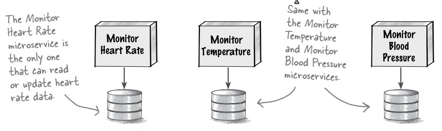

note:
- gaat om het beheersen van wijzigingen
  - aangezien maar één service elk schema gebruikt, kan die schema wijzigen zo lang API constant blijft
    - niet mogelijk als meerdere services zelfde schema aanspreken
    - zelfde gezien bij modular monolith wanneer communicatie via API moest verlopen en data gepartitioneerd werd
    - merk op: overhead van meer communicatie
- vereist niet noodzakelijk verschillende DB servers, gewoon schema's!

---

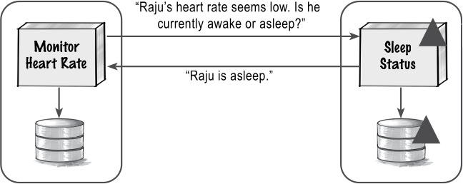
note:
- toont hoe "monitor heart rate" te weten komt of patiënt slaapt
  - nodig om te weten of hartslag veilig is
- als er iets wijzigt aan de databasestructuur van "sleep status", merkt "monitor heart rate" daar niets van
- je ziet de kostprijs: coördinatie over services heen zal moeilijker zijn, bijvoorbeeld transacties die over meerdere services gaan

---

## Wat is "klein"?
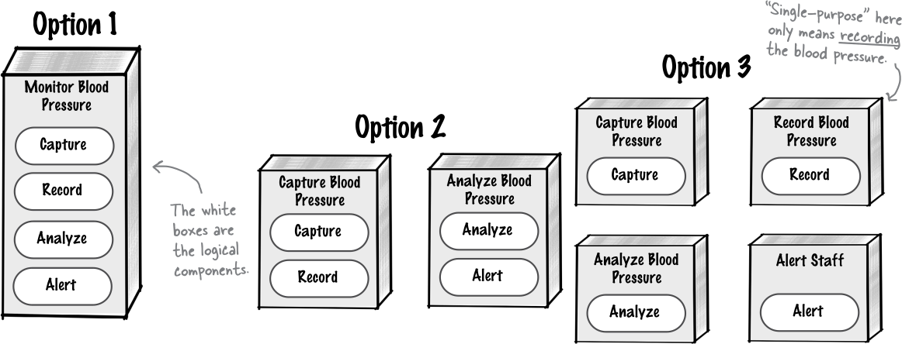
note:
- zoals op eerdere slide: meer opdeling heeft ook een kostprijs, namelijk omslachtigere communicatie
- elke service heeft zijn eigen database, dus optie 1 is "makkelijker" maar moeilijker schaalbaar en moeilijker te testen; optie 2 zit halverwege; optie 3 is het andere uiterste
  - merk op: optie 1 heeft meer kenmerken van een monolitische stijl

---
## Granularity integrators en disintegrators

note:
- factoren die ons in een bepaalde richting sturen
  - gelukkig zijn deze vrij goed omschreven
- **granularity integrators** duwen ons in de richting van grotere services
- **granularity disintegrators** duwen ons in de richting van kleinere services
- beide types zullen aan het werk zijn, hou bij in een ADR wat meeste gewicht heeft
- neem even tijd om na te denken over factoren die in ene of andere richting kunnen sturen

---

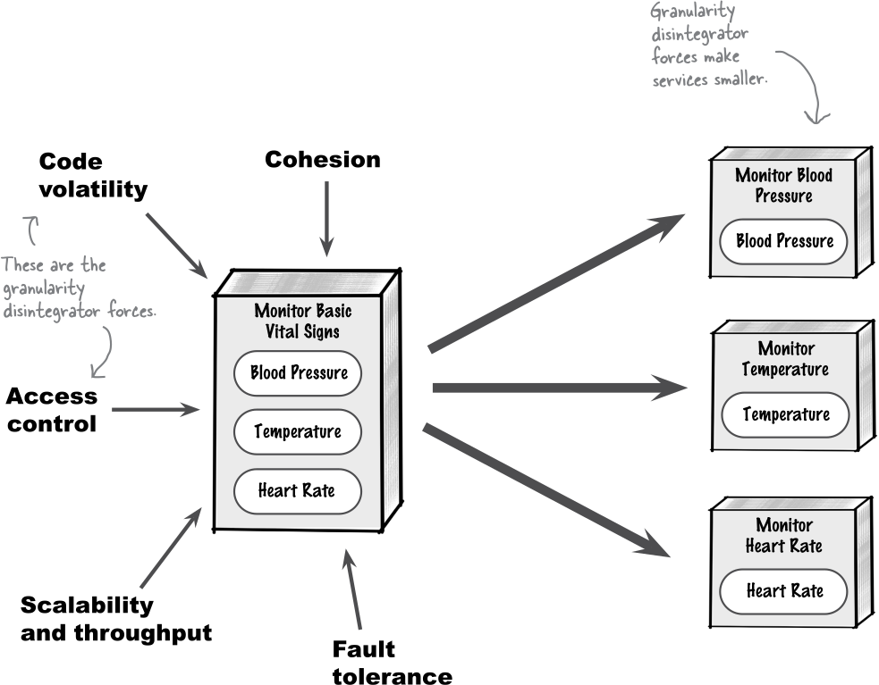

---

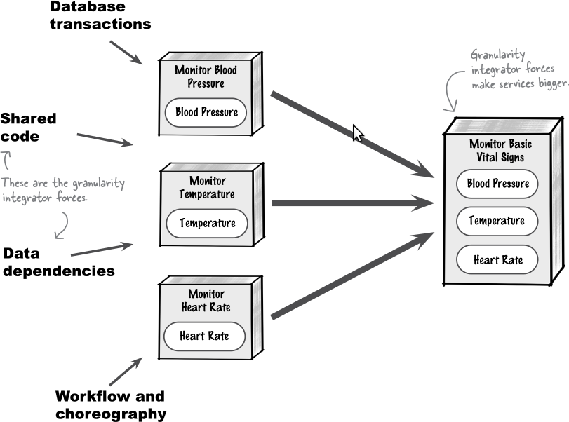

note:
- liggen allemaal conceptueel dicht bij elkaar in vergelijking met de disintegrators
- het gaat hem om het aantal factoren en hun gewicht, geen enkel van deze zaken betekent dat je **moet** integreren want ze hebben allemaal wel workarounds, maar je wil niet heel de tijd workarounds voorzien

---

## Gemeenschappelijke functionaliteit

note:
- stel even situatie voor: meerdere services moeten zelfde deeltaak kunnen uitvoeren
  - bv. alle vital sign monitors moeten een noodsignaal kunnen sturen
  - ook "saaie" taken: logging, metrics, authenticatie,...

---

### Extra service
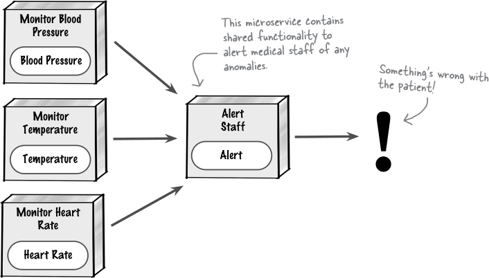

note:
- voordelen:
  - iedereen heeft altijd recentste update
  - programmeertaal maakt niet uit
- nadelen:
  - vertraging
  - service wijzigen heeft impact op alle gebruikers
  - risicio op onbereikbaarheid
  - moet meeschalen met gebruikers

---

### Gedeelde library
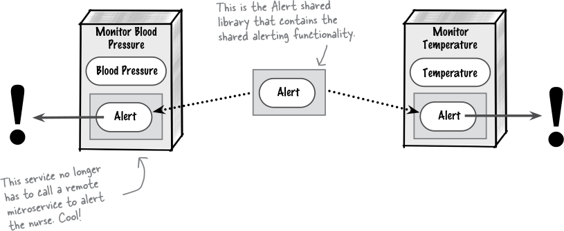

note:
- in labo rond microkernel een gemeenschappelijke library gemaakt voor plugins en core (en gecompileerd tot .dll) met daarin IPlugin en BerekendeCel
- voordelen:
  - betere performance
  - schaalt vanzelf mee
  - wijzigingen zijn niet zo'n probleem
- nadelen:
  - meerdere versies library nodig als de microservices in verschillende talen geschreven zijn
  - veel overhead: "deze service gebruikt deze versie van de library,..."
  - wijzigingen vereisen dat we gebruikers opnieuw compileren, testen en deployen

---

## Workflows
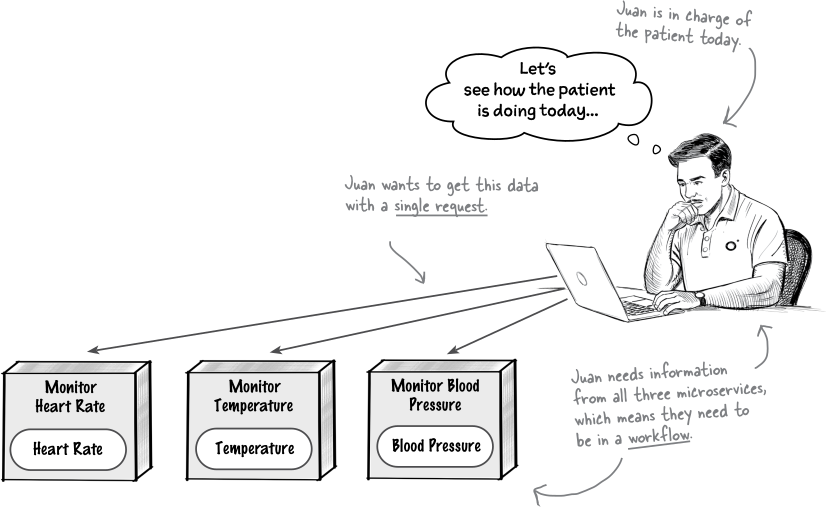

note:
- taken die over meerdere microservices heen lopen
- denk even na: welke opties zie je?

---

### Orchestration
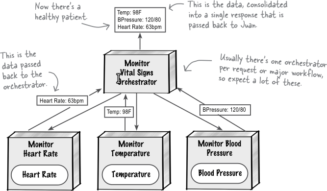

note:
- de gecentraliseerde oplossing
- in essentie: een extra service weet hoe hij al individuele services moet coördineren
- bestaan gespecialiseerde tools voor (Airflow,...) of "roll your own"

---

### choreography

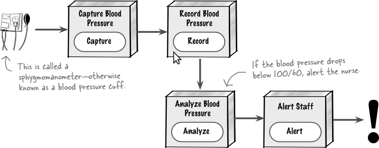

note:
- de gedecentraliseerde oplossing
- elke service weet welke rol hij heeft in een gegeven workflow (kan voorafgaand werk ontvangen en resterend werk opstarten)
- let op: eerste service is niet tegenhanger van orchestrator! resultaten tussenstappen worden **doorgegeven**

---

| aspect                  | orchestration | choreography |
|-------------------------|---------------|--------------|
| duidelijk leesbaar      | ✅            | ❌           |
| afhandelen fouten       | ✅            | ❌           |
| aanpasbare workflows    | ✅            | ❌           |
| bijhouden state         | ✅            | ❌           |
| performance             | ❌            | ✅           |
| schaalbaarheid          | ❌            | ✅           |
| koppeling               | ❌            | ✅           |
| availability bottleneck | ❌            | ✅           |

note:
- leesbaar: alles op één plaats, tegenover verspreid
- fouten: error handling op een plaats tegenover overal
- aanpasbaar: één service te redeployen tegenover allemaal
- performance: ongeveer dubbel zo veel over-en-weer communicatie
- bijhouden state: bv. als taak gedeeltelijk gelukt is en er dan timeout optreedt kan dat op centrale plaats onthouden worden, later eventueel hernomen
- schaalbaarheid: alle workflows moeten door bottleneck of net niet
- koppeling: denk terug aan wet van Demeter
- availability: zie schaalbaarheid
- **technisch geen reden waarom beide niet gaan (voor verschillende workflows)**

---

## ↔ modular monolith
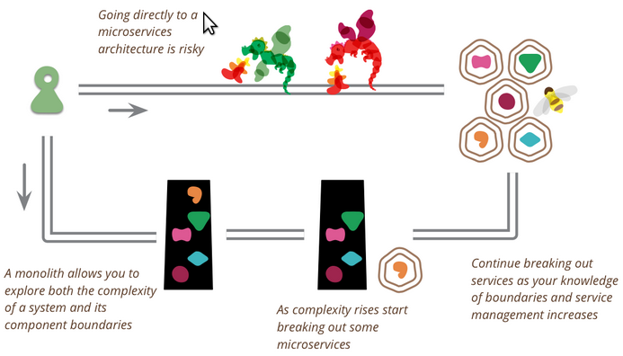

note:
- eerder gezien: modular monolith waarbij enkel via API gecommuniceerd wordt + waarbij elk domein eigen DB heeft
  - dan is microservices in eerste zaak apart deployen en workflow management kiezen

---

- ✅ geïsoleerde aanpassingen
- ✅ testbaar
- ✅ aanpasbaar
- ✅ aparte deployments
- ✅ goed schaalbaar
- ✅ fouttolerantie
- ❌ complex
- ❌ workflow management
- ❌ performance
- ❌ data ownership nodig
- ❌ vereist all-round teams

note:
- data ownership kan lastig zijn: gedistribueerde transacties zijn moeilijk, foreign key referenties naar data van andere services gaan niet,...
- "all-round": kan niet bijvoorbeeld alle UI designers in zelfde bureau samen zetten, alle developers ergens anders

---

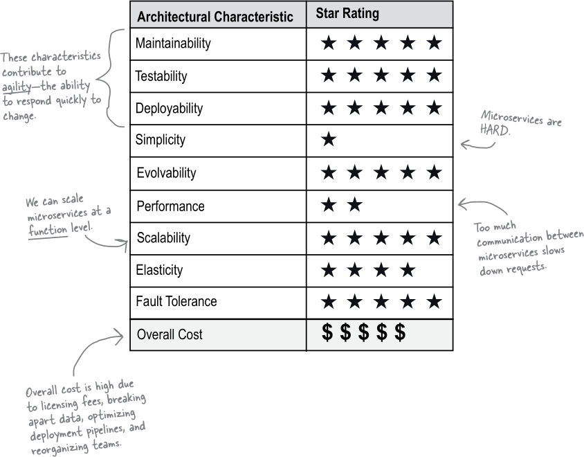

---

note:
- Kubernetes speelt hier grote rol
  - grote verschil met Docker Compose: multi-machine (of zelfs multi-cloud), ingebouwde scaling en state management
  - niet elke microservice heeft een dedicated machine of VM nodig, we maken (typisch) gewoon containers, zetten die op in deployments en Kubernetes zal ze over verschillende machines verdelen
- "orchestrator" ≠ voor workflow orchestration, het gaat om verschillende niveaus van "dirigeren"
