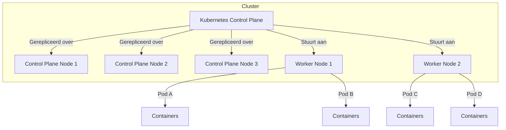
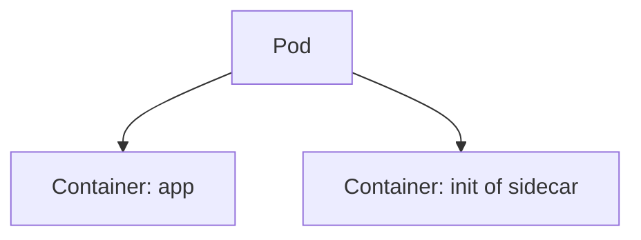
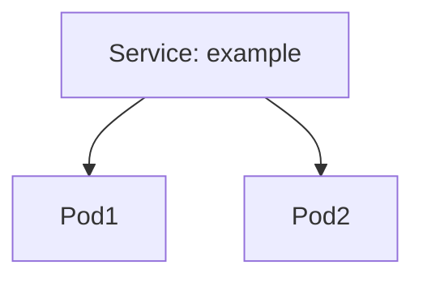

# Project + Kubernetes

---

## Project

note:
- opgave staat op DigitAP
  - Markdown formaat, ook formaat waarin ik oplossing verwacht ⇒ Markdown preview van VSC is geschikt
- kan al een deel maken, maar nog niet alles
- overlopen

---

## Kubernetes

- **container** orchestrator
- ↔ Docker Compose
  - scaling
  - self-healing
  - rollouts
  - rollbacks
  - load balancing

---



note:
- schema toont hoe Kubernetes dit allemaal kan
- control plane bestaat uit meerdere nodes, typisch 3 of 5 zodat er een duidelijke meerderheid blijft bij communicatieprobleem
- worker nodes zijn typisch *andere* machines
- nodes komen op een "overlay network": van uit hun perspectief lijkt het alsof ze op een lokaal netwerk zitten, ook als ze geografisch verspreid zijn

---

## Imperatief vs. declaratief

note:
- twee manieren om Kubernetes te gebruiken
  - door één voor één commando's te runnen (**imperatieve** werkwijze)
  - wat we in labo gedaan hebben om te schalen: `kubectl scale --replicas=3 mydeployment`
- door YAML files te schrijven met de gewenste configuratie (≈Docker Compose, Ansible,...) (**declaratief**)
  - zie voorbeeld YAML's: `replicas: 3` in plaats van commando zoals in labo
- wij zullen (zoals bijna iedereen) declaratieve manier verkiezen

---

```yaml
kind: Service 
apiVersion: v1 
metadata:
  name: nginx-service 
spec:
  type: NodePort
  selector:
    app: nginx 
  ports:
    - nodePort: 30163
      port: 8080
      targetPort: 80
```

note:
- typische voorbeeld van declaratieve config
  - complex, maar `kubectl explain (resourcetype)` en `kubectl explain (resourcetype).(veldnaam)` helpen
    - en anders nog altijd VSC extension en documentatie
- kunnen meerdere resources (services, deployments,...) in één file zetten door te scheiden via `---` of aparte files maken
  - gevolg: we kunnen deze zaken los van elkaar deployen
- de details zijn nog niet belangrijk, maar voor wie zich afvraagt... dit lijkt op port forwarding van Docker (Compose), maar er is een extra niveau:
  - `targetPort` is zoals de guest port van Docker
  - `port` is de poort **binnen de cluster**
  - `nodePort` is de poort om van buiten de cluster toegang te verkrijgen

---

## Belangrijkste concepten

- Cluster
- Node
- Pod
- Deployment
- Service

note:
- verzameling machines waarop Kubernetes runt
  - opgedeeld in control plane en worker plane, nog niet zo belangrijk nu
  - deze heb je al op single-node / kan "managed" aangeboden worden / kan je zelf opzetten
    - om zelf op te zetten: VM's of machines in netwerk
- node: één "fysieke" machine
- rest: volgende slides
- `kubectl get ...s` om instanties (behalve clusters) te zien en `kubectl explain ...` om de syntax voor dit soort resource te zien

---

## Pods

note:
- wrappers voor containers (of VM's of WASM apps of serverless functies maar vooral containers)
- immutable (let op, niet de containers, wel *de pods zelf*)
  - we updaten pods niet, we vervangen ze
- typisch één container (soms extra)
- één IP-adres
- shared storage & netwerk
- wordt als één eenheid gescheduled
  - betekent dat we niet één container binnen een pod kunnen vervangen, moeten hele pod vervangen
- **let op:** zal deze normaal niet zien in `docker ps`, wel met `kubectl get pods`

---



note:
- pod heeft een "eerste container"
- init container runt volledig voor eerste container, doet opstarttaken
- sidecar container runt in parallel, kan extra diensten leveren zonder dat deze in code samengevoegd moeten worden

---

## Deployments

note:

- declaratieve manier om pods te beheren
- staat toe onder andere te managen:
  - juist aantal pods (replica's)
  - rolling updates
    - probeer eens: `kubectl explain deployment.spec.strategy.rollingUpdate`, doe een update van een voorbeelddeployment
  - rollbacks

---

```yaml
apiVersion: apps/v1
kind: Deployment
metadata:
  name: nginx-deployment
  labels:
    app: nginx
spec:
  replicas: 3
  selector:
    matchLabels:
      app: nginx
  template:
    metadata:
      labels:
        app: nginx
    spec:
      containers:
      - name: nginx
        image: nginx:1.14.2
        ports:
        - containerPort: 80
```

note:
- merk op: `template` omvat hoe pods er moeten uitzien

---

### Services

Types:
- ClusterIP: intern (default)
- NodePort: toegankelijk via poort op node
- LoadBalancer: via cloud load balancer

note:
- pods zijn "vluchtig", intern IP-adres is eigenlijk niet geschikt voor communicatie, te veel wijziging
- vergelijk Service met postbus
- koppeling aan pods juiste pods (via labels)
- NodePort doet round robin load balancing, maar dat is niet zichtbaar als we in Lens,... nog port forwarding moeten voorzien
- "via cloud load balancer": kan dus integreren met load balancer van Azure/AWS/...

---



---

## IaC

note:
- tools als Ansible,... zorgen ook voor declaratieve configuratie
  - betreft eerder *infrastructuur*, bv. opzetten van een cluster
    - Kubernetes is dan voor het runnen van *applicaties*
