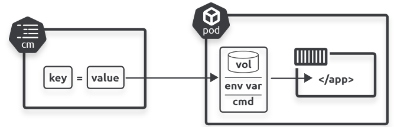
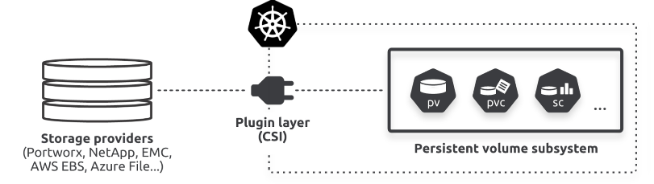
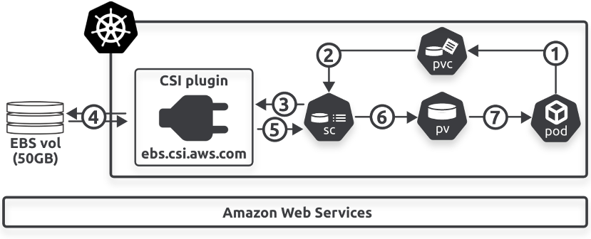

# Configuratie + storage

note:
- configuratie: files, opstartargumenten, omgevingsvariabelen en secrets
- storage: pods zijn in principe stateless, maar data mag niet zomaar met pods verdwijnen
  - typisch voorbeeld (zie ook DevOps): database server: data moet container/pod overleven

---

## Configuratie

note:
- geen goed idee images te maken waarin **alles** ingebakken is
  - d.w.z. image maken om wachtwoord in te stellen,...
  - maakt gebruik van public repos al onmogelijk
  - vereist rebuilds voor zaken die we anders ook niet in code zouden zetten
    - vb.: aparte images bouwen (en bijhouden) voor development, testing, productie
- voorzien van omgevingsvariabelen (ConfigMaps)
- voorzien van gevoelige info (Secrets)

---

## ConfigMaps (CMs)

note:
- key-value stores die een omgeving definiëren
  - dus aparte map voor development, testing, productie,...
- **niet** alleen omgevingsvariabelen
  - eerder "alles waarvoor we geen nieuwe build van onze image willen"

---

note:
- steeds na te gaan via `kubectl describe cm`

---

### Via volume

note:
- zie eerst apache-indexfile-configmap.yaml
- let op de syntax met de `|` en de spatie ervoor
- bij grotere pagina's is het beter deze CM te genereren met `kubectl create configmap --from-file`
  - geen probleem om meermaals `--from-file` mee te geven
- probeer eens uit met `index.html` en `style.css` en toon dan de inhoud met `kubectl describe cm`
- je kan CI/CD tools gebruiken om de `kubectl create configmap` te runnen of outputten naar YAML voor versiebeheer (beter om gegenereerde files uit versiebeheer te houden)
- propageert naar pods, maar kan even duren

---

### Via omgevingsvariabelen

note:
- demonstratie uitwerking MySQL Pod
  - note: hier zouden we ook **persistent** volume aan willen koppelen, voorlopig even niet
- opmerking: voorlopig aan te raden 1 DB server / deployment te voorzien (al kan dat voor localiteit een issue vormen)
  - zo is DB nog steeds bottleneck per deployment, maar niet voor het geheel
  - bestaan ook managed DB's (van de cloud provider) of DB's die gemaakt zijn voor de gedistribueerde context (e.g. CockroachDB)
- **aanpassingen aan de ConfigMap zullen niet weerspiegeld worden in reeds lopende containers!**

---

### In opstartargumenten

note:
- technisch zowat zelfde aanpak als omgevingsvariabelen
- verschil: we gebruiken deze in een expliciet opstartcommando voor de container
- voorbeeld: hello-gebruiker.yaml
- dus ook zichtbaar als omgevingsvariabelen binnen de container als die blijft lopen

---

## Secrets

note:
- vrijwel identiek aan ConfigMaps, maar bedoeld voor gevoelige info
  - **technisch niet genoeg**, maar een fundering ⇒ we komen hier op terug in les over authenticatie
    - door de zaken alvast in Secrets te zetten en achteraf zaken toe te voegen (zoals gegarandeerde encrypte van verkeer binnen de cluster), maken we ze wel veiliger
- injecteren gebeurt op zelfde drie manieren als data uit ConfigMaps
- run eens `kubectl describe` om verschil op te merken
- zie voorbeeldpod: per secret vinden we een file

---

## Storage

---

note:
- "CSI" staat voor "container storage interface"
  - cloud provider biedt een systeem voor storage aan, maar we gebruiken dit niet rechtstreeks
    - gevolg 1: Kubernetes clusters kunnen gemigreerd worden tussen cloud providers
    - gevolg 2: code voor storage systemen kan los van kerncode van Kubernetes geschreven worden

---

### Basisconcepten

- PersistentVolumes (PV)
- PersistentVolumeClaims (PVC)
- StorageClasses (SC)

note:
- al deze afkortingen zijn bruikbaar in `kubectl`
- PV: ongeveer zoals een volume in Docker, zie als een harde schijf of wat dan ook die we aansluiten ergens op onze pod
- PVC: een "certificaat" om aan te geven dat een bepaalde Pod een PV wil gebruiken
- SC: een omschrijving van een **soort** storage, bijvoorbeeld "dure, snelle SSD-opslag" of "goedkope, trage HDD-opslag"
  - kunnen dit bypassen als we een hostpath volume gebruiken, vergelijkbaar met een bind mount in Docker
  - we kunnen een SC aanspreken om een persistent volume aan te maken
  - een bepaalde SC moet ondersteund worden door de cloud provider waarop de cluster runt
  - we gaan zelf zelden SC's definiëren, we gebruiken normaal die van de provider

---

note:
- AWS wordt hier onderaan vermeld omdat we interfacen met EBS (elastic block storage), dit kan volgens hetzelfde systeem op elke andere cloud provider, maar de dienst voor opslag zal wat anders heten
  - elke provider voorziet zijn eigen CSI plugin
- algemeen patroon: via Kubernetes gebruiken we functionaliteit van de provider, maar Kubernetes biedt een extra laag abstractie toe, waardoor we veel makkelijker naar een andere cloud provider kunnen overstappen

---

## Voorbeeld: web server files via PV

note:
- zie httpd-with-pv.yaml
- data blijft bewaard bij gebruik identieke pod op zelfde node
- test uit door een pod op basis van `curlimages/curl` te runnen voor het gemak

---

## Uitwerking MySQL

note:
we willen:
- persistentie
- bereikbaarheid van buiten de cluster
- gebruik van Secrets voor gevoelige info
