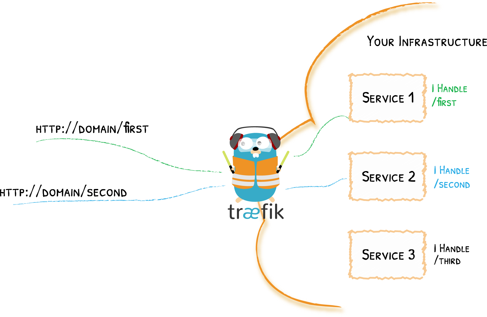
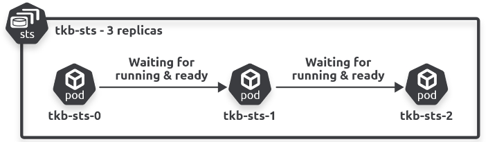
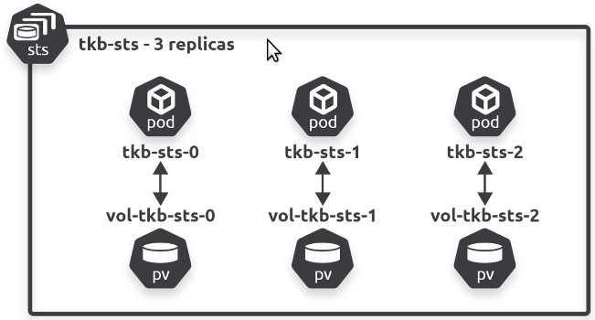

# Ingress en StatefulSet

note:
- uitbreidingen op Service en Deployment, respectievelijk

---

## Ingress

---

### Opfrissen Services

note:
- ClusterIP (intern)
- NodePort (bereikbaar via vaste poort op de node)
  - kan dus niet zomaar via DNS
- LoadBalancer (bereikbaar via adres load balancer cloud provider)
  - hier krijg je wel een DNS entry voor

---

### Meerdere diensten

note:
- stel je voor: meerdere diensten die bereikbaar moeten zijn via Internet
- moeten op zijn minst via een `NodePort Service` beschikbaar gemaakt worden
  - maar dan werken we met poortnummers
- dan maar LoadBalancer?
  - kan, maar dan moeten we één `LoadBalancer` per bereikbare `Deployment` voorzien
    - cloud load balancers kosten geld

---

### Workaround

note:
- gezien bij DevOps (maar niet essentieel voor deze uitleg): reverse proxy
  - machine op de "rand" van netwerk, ontvangt en analyseert inkomend verkeer
    - DNS entries wijzen naar reverse proxy
    - reverse proxy analyseert gebruikte domeinnaam en pad en treedt op als tussenpersoon

---

note:
- dit kan je eigenlijk nog steeds toepassen, geen technische reden waarom niet
- tekortkomingen
  - Kubernetes managet niet meer hoe eigen diensten bereikt worden
  - configuratie moet manueel gedaan worden (`nginx.conf`, `traefik.yaml`,...)
  - kan uitdagend zijn TLS in orde te brengen
  - het punt van Kubernetes is om aanpassingen binnen de cluster automatisch te laten verlopen...

---

### Ingress Controller

note:
- in essentie een reverse proxy die in een Pod runt
  - je kan zelf kiezen wat voor reverse proxy, bv. NGINX (default), Traefik,...
- nauw geïntegreerd
  - nieuwe routeringsregels (de `Ingress`es zelf) kunnen gewoon toegepast worden door middel van `kubectl`

---

### Voorbereiding demonstratie

note:
- moeten bepaalde DNS entries resolven naar localhost
- [uitleg Windows](https://en.wikiversity.org/wiki/Hosts_file/Edit)
- Mac en Linux: `/etc/hosts` aanpassen
- zullen `app1.demowebsite.com` en `app2.demowebsite.com` laten resolven naar 127.0.0.1 (dus voor die domeinnaam vindt geen DNS lookup plaats)
- reminder: kunnen files zichtbaar maken in pods door een `ConfigMap` (configuratie) te maken met filenamen als keys en die dan te gebruiken om een volume in te vullen

---

### Demonstratie (aanpak 1)

note:
- een `Deployment` van de reverse proxy
  - een `ConfigMap` om er de nginx.conf file in te zetten
  - een `Service` om deze aanspreekbaar te maken (zou normaal `LoadBalancer` zijn maar doen dit lokaal dus `NodePort`)
- twee `Pod`s met een Apache web server
  - ieder een eigen `ConfigMap` om eigen files te hebben
  - ieder een eigen `Service` om aanspreekbaar te zijn binnen de cluster (door de reverse proxy)

---

### Demonstratie (aanpak 2)

note:
- de `Deployment`, `ConfigMap` en `Service` voor de reverse proxy verdwijnen
- `Ingress` komt in de plaats, de `ingressClassName` geeft aan dat we achter de schermen nog steeds een NGINX gebruiken
- configuratie niet meer in de vorm van tekst in een file, we gebruiken expliciet namen van services dus Kubernetes kan beter fouten vaststellen
  - dus je zal hier foutmeldingen zien via `kubectl`, Lens,... waar dat niet zo zal zijn met aanpak 1
- omdat we geen `NodePort` service gebruiken, hoeven we geen poort 30001 te gebruiken (dit hangt wel af van hoe je Kubernetes setup tunneling afhandelt, de mijne gebruikt gewoon de corresponderede poort)
- zouden nog steeds een NGINX pod moeten terugvinden (de Ingress Controller)

---

## StatefulSets

---

### Uitdagingen gedistribueerde aanpak

note:
- paar keer vermeld: "Pods zijn stateless" en "Pods worden vervangen door nieuwe Pods van hetzelfde type"
- voorbeeld van iets dat mis kan lopen:
  - we hebben een cluster met meerdere nodes
  - we hebben een `Deployment` met één replica voor een MySQL server
  - de `Pod` heeft een `PersistentVolumeClaim` voor een volume dat gemapt wordt op `/var/lib/mysql` (zodat data bijgehouden wordt)
  - het toegewezen volume is lokale opslag van de host node, bijvoorbeeld `/data`
  - de `Pod` moet vervangen worden (crash of update)
  - de vervanger komt wordt op een andere node geplaatst
  - `/data` bevat niet de gewenste data!
- dit soort problemen kom je minder makkelijk tegen in een single-node cluster met één replica, maar dat is eigenlijk alleen maar een didactische tool

---

### Idee oplossing

note:
- Pods moeten vervangen worden door Pods met zelfde "state"
  - zelfde naam
  - zelfde DNS hostnaam
  - zelfde volume bindings

---

### StatefulSet

note:
- zoals een `Deployment`
- maar vervangers van Pods hebben dezelfde state als het origineel
  - zelfde naam
  - zelfde DNS hostnaam
  - zelfde volume bindings
  - **zelfs** als ze vervangers op andere nodes worden geplaatst
- typische toepassingen
  - geclusterde applicaties (peer-to-peer of primary-secondary)
  - persistent storage
- niet alleen maar voordelen:
  - Pods moeten één voor één opstarten en uitgeschakeld worden (anders zouden er bugs optreden)
  - moeten terugschalen naar 0 replica's voor we een `StatefulSet` verwijderen
  - kunnen andere beperkingen zijn rond welke functionaliteit van je cloud provider je in een StatefulSet kan gebruiken

---

### Sequentie

---

### Mapping volumes

note:
- persistente volumes bestaan *los* van Pods, dus het is belangrijk dat ze toegekend worden aan "dezelfde" pods
- merk op hoe de namen van de Pods binnen dezelfde StatefulSet systematisch toegekend zijn en makkelijk te matchen zijn aan de volumes
- **implicatie**: `StatefulSet` kan ook zinvol zijn als er maar één replica is, want met sommige clusterconfiguraties en storagetypes is niet gegarandeerd dat vervanger steeds zelfde storage krijgt
- we gebruiken `volumeClaimTemplates` (in plaats van `PersistentVolumeClaim`), het gaat technisch om een nieuwe claim wanneer we een pod vervangen

---

### Demonstratie 1

note:
- start alleen de `StatefulSet` in bijlage `mongo-statefulset`
- inspecteer de definitie en merk op: `serviceName`
- doe `kubectl get pods`
- voer de `kubectl explain` vermeld in het tekstbestand
- **pods zijn normaal niet aanspreekbaar via DNS-entry voor naam**, vandaar dat een `StatefulSet` een "governing service" nodig heeft (want Services registreren records in interne DNS)
- dit wordt een speciaal soort `Service`, namelijk een **headless** `Service`
  - deze spreken we niet aan zoals een `ClusterIP` service (of `NodePort` of `LoadBalancer`) maar hij creëert wel DNS-entries **voor de achterliggende Pods**
    - het "head" is dus het eigen cluster IP van de service: dat is hier niet aanwezig
- om dit aan te tonen: start eerst de `StatefulSet` zonder een governing service, log in op een Pod, probeer een van de andere te pingen via naam (bv. `ping tkb-sts-1.tkb-sts` vanuit `tkb-sts-0`)
  - herhaal dan na opzetten van de headless service

---

### Demonstratie 2
note:
- voorbeeld: MySQL met primary (writeable) en secondary (read-only, synct regelmatig met primary)
  - manier om performance te verbeteren zonder totaal nieuwe DB te gebruiken
  - behoren tot zelfde `StatefulSet` maar hebben ander configuratiebestand
    - we gebruiken init containers die de podnamen bekijken om de juiste pod het juiste configuratiebestand te geven
  - oké zolang clients van de secondary iets oudere data te zien mogen krijgen
- **dit kost tijd en moeite, ook zonder Kubernetes of Docker**: stappen [hier](https://dev.mysql.com/doc/refman/8.4/en/replication-howto.html) en info [hier](https://hub.docker.com/_/mysql) nodig gehad en moeten lezen, dus onthoud vooral:
  - er zijn twee replica's
  - beide replica's hebben eigen files nodig (configuratie en opstartscripts)
  - we moeten kunnen garanderen dat `mysql-0` de primary is
- uittesten: makkelijkste is op de replica in te loggen en te merken dat we aanpassingen van de primary zien
